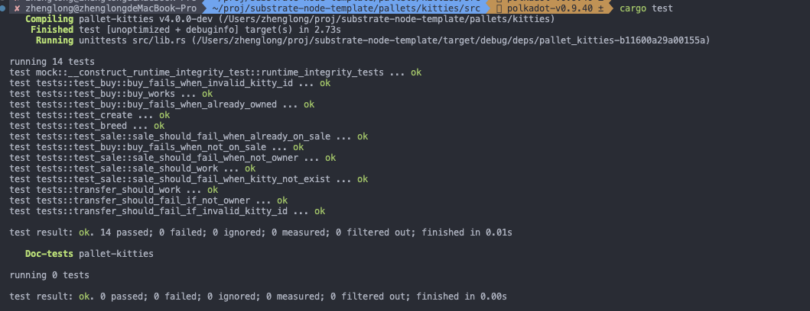

1. 在工程根目录添加 rust-toolchain.toml 文件

```toml
[toolchain]
channel = "nightly-2023-01-01"
components = [ "rustfmt" ]
targets = [ "wasm32-unknown-unknown" ]
profile = "minimal"

```

```
rustup install nightly-2023-01-01
rustup target add wasm32-unknown-unknown --toolchain nightly-2023-01-01
cargo +nightly-2023-01-01 build --release
```

2. 编译 node

```sh
cargo build --release 
```

3. 启动 node

```sh
./target/release/node-template --dev --base-path tmp/kitties
```


4. 创建


5. 链上状态


6. 添加升级代码后重新启动


7. 查看状态


8. 升级


9. 重新查询


10. 创建


11. 单元测试

