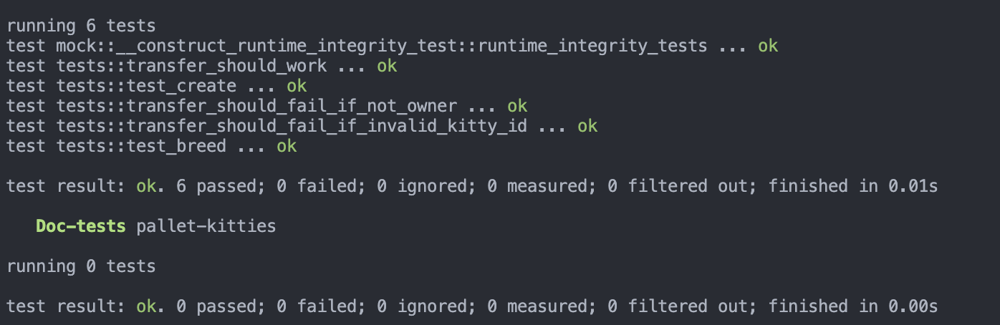
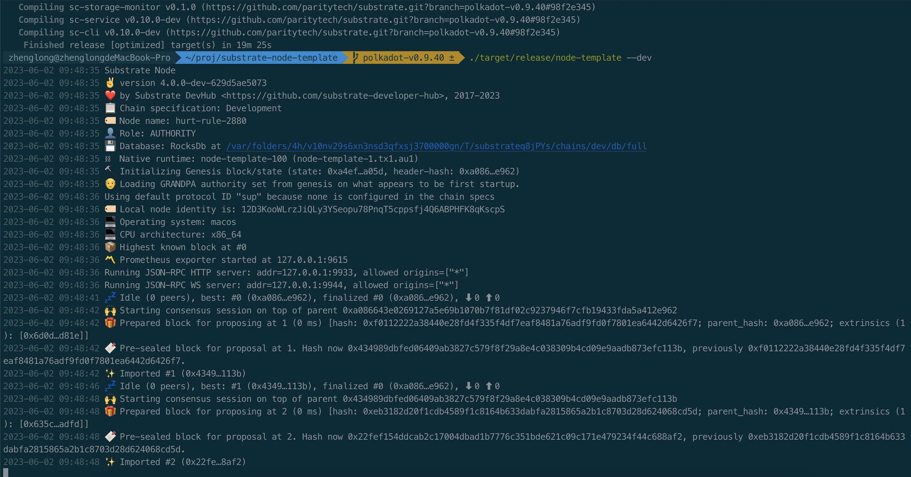

单元测试



在工程根目录添加 rust-toolchain.toml 文件

```toml
[toolchain]
channel = "nightly-2023-01-01"
components = [ "rustfmt" ]
targets = [ "wasm32-unknown-unknown" ]
profile = "minimal"

```

编译 node

```sh
cargo +nightly build --release --target 
```

启动 node

```sh
./target/release/node-template --dev
```


